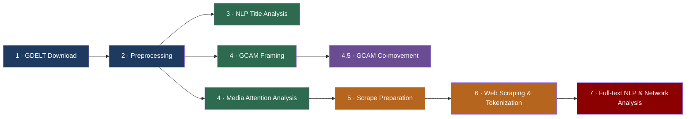

# GDELT Media Attention & Framing Analysis


> A reproducible research pipeline for analyzing global media attention and semantic framing during major geopolitical crises using [GDELT](https://www.gdeltproject.org/) data.

The project adopts a **descriptive and reproducible research design**, focusing on media attention dynamics and linguistic framing rather than predictive modeling or causal inference.

---

## Research Focus

- 📈 Temporal evolution of media attention during geopolitical crises
- 🧠 Semantic framing analysis using GCAM variables
- 🌍 Cross-regional and cross-media comparisons
- 📝 NLP-based validation on high-attention news articles

---

## Pipeline Overview



---

## Pipeline Scripts

All scripts are located in `src/` and numbered to reflect execution order.

| # | Script | Description |
|---|--------|-------------|
| 1 | `1gdelt_download.R` | Downloads raw GDELT GKG and Mentions data for defined event windows |
| 2 | `2gdelt_preprocess.R` | Cleans, parses, and structures raw GDELT files into analysis-ready datasets |
| 3 | `3gdelt_titles_nlp.R` | Performs NLP analysis on article titles (tokenization, word frequencies, word clouds) |
| 4 | `4gcam_framing.R` | Extracts and analyzes GCAM framing dimensions from GKG records |
| 4 | `4gdelt_media_attention_analysis.R` | Analyzes temporal dynamics of media attention using daily mention counts |
| 4.5 | `4.5gcam_analysis.R` | Explores co-movement between GCAM framing scores and media attention |
| 5 | `5gdelt_scrape_prepare.R` | Selects high-attention articles and prepares URLs for web scraping |
| 6 | `6gdelt_scrape.R` | Scrapes article full texts and tokenizes content for downstream NLP |
| 7 | `7gdelt_nlp.R` | Builds media attention networks across domains using graph analysis |

---

## Data

The analysis relies on GDELT **Global Knowledge Graph (GKG)** and **Mentions** datasets.

Raw GDELT data are not included in the repository due to size constraints, but they can be fully reconstructed by running the download and preprocessing scripts provided in `src/`.

---

## Project Structure

```text
src/                  # R scripts implementing the analysis pipeline
data/
  ├── raw/            # Raw GDELT data (not included)
  └── processed/      # Intermediate datasets used in the analysis
results/
  └── tables/         # Aggregated outputs and result tables
report/
  └── report.pdf      # Final research report
```

---

## Methodological Notes

- The project is explicitly **descriptive**
- No causal inference or sentiment classification is performed
- NLP techniques are used for exploration and qualitative validation only
- Methodological limitations are discussed in the report

---

## Report

The final research reports are available in the `report/` directory:

- `report/report_es_it.pdf`
- `report/report_it.pdf`

The documents are written in **Spanish and Italian**, reflecting the academic context in which the project was developed.

---

## Reproducibility

All scripts are numbered to reflect the logical execution order of the pipeline.
The repository is structured to allow full reproduction of the analysis, excluding raw data downloads.

```bash
# Run the full pipeline in order
Rscript src/1gdelt_download.R
Rscript src/2gdelt_preprocess.R
Rscript src/3gdelt_titles_nlp.R
Rscript src/4gcam_framing.R
Rscript src/4gdelt_media_attention_analysis.R
Rscript src/4.5gcam_analysis.R
Rscript src/5gdelt_scrape_prepare.R
Rscript src/6gdelt_scrape.R
Rscript src/7gdelt_nlp.R
```

### Key Dependencies

| Package | Purpose |
|---------|---------|
| `data.table` | High-performance data manipulation |
| `ggplot2` | Data visualization |
| `tidytext` | Text mining and tokenization |
| `stringr` | String processing |
| `wordcloud` | Word cloud generation |
| `igraph` | Network / graph analysis |
| `dplyr` | Data wrangling |
| `RColorBrewer` | Color palettes |
